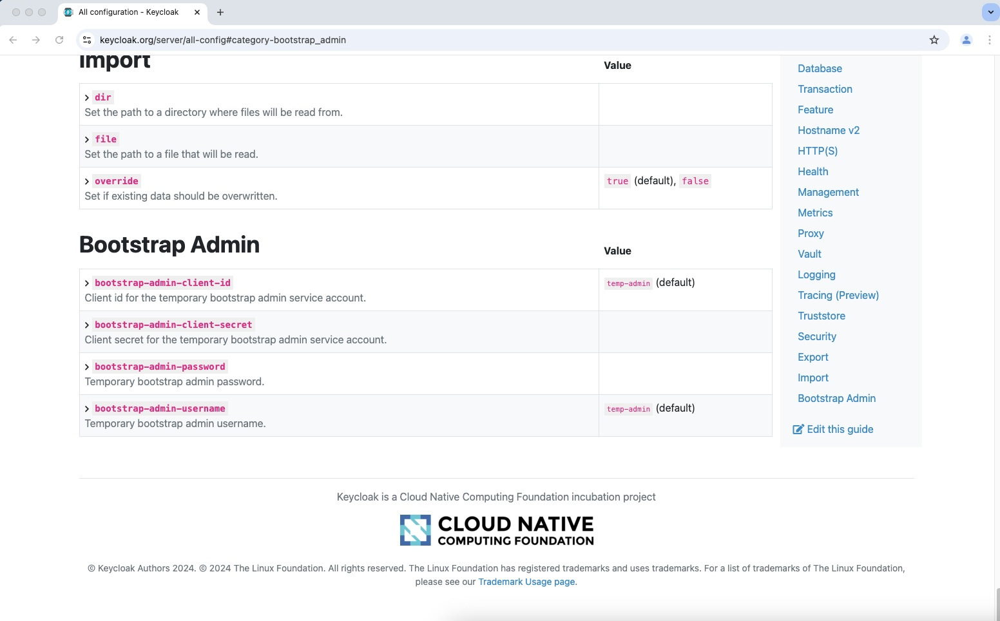

Title: How to configure Keycloak Terraform provider for automated provisioning
Description: Since v26.0.0 Keycloak provides new configuration options for bootstrapping an admin service account   
Summary: Since v26.0.0 Keycloak provides new configuration options for bootstrapping an admin service account
Date: 2025-01-10 11:00
Author: Max Pfeiffer
Lang: en
Keywords: Keycloak, OpenTofu, Terraform, Terraform Provider, bootstrapping, Kubernetes
Image: https://max-pfeiffer.github.io/images/2025-01-10_keycloak_config_option.jpeg
original_url: blog/how-to-configure-keycloak-terraform-provider-for-automated-provisioning.html

The [Keycloak](https://www.keycloak.org/) software engineers decided
[to introduce an admin service account for bootstrapping Keycloak](https://github.com/keycloak/keycloak/issues/9829#issuecomment-2109799158).
This configuration option is available since Keycloak v26.0.0 but is currently not mentioned in their
[admin bootstrap documentation](https://www.keycloak.org/server/bootstrap-admin-recovery). But it is listed on the
[summary page for configuration options](https://www.keycloak.org/server/all-config#category-bootstrap_admin).

I tested my automated Keycloak provisioning process using the new environment variables `KC_BOOTSTRAP_ADMIN_CLIENT_ID`
and `KC_BOOTSTRAP_ADMIN_CLIENT_SECRET` with [OpenTofu](https://opentofu.org/). It works like a charm.

Thanks a lot to the Keycloak team for providing such an option. It makes life so much easier when you use the
[Keycloak Terraform provider](https://github.com/keycloak/terraform-provider-keycloak). Especially when you
manage the Keycloak installation with [OpenTofu](https://opentofu.org/) or Terraform as well. This way you are able
to install and configure [Keycloak](https://www.keycloak.org/) in one go.

It took me quite a while to find out about that new feature as it is mentioned hardly anywhere in docs. So I decided
to write that article as it might help somebody else to learn about that great new [Keycloak](https://www.keycloak.org/)
feature.

## Related Articles

* [How to Bootstrap a Certificate Authority in your Kubernetes Cluster]({filename}/2025-01-20_bootstrap_certificate_authority_for_kubernetes.md)
